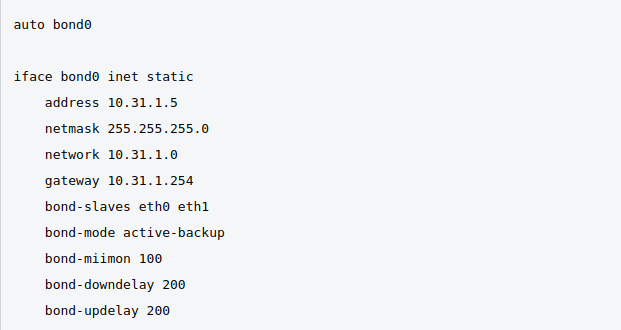

1. Проверьте список доступных сетевых интерфейсов на вашем компьютере. Какие команды есть для этого в Linux и в Windows?

    * Решение:
    * В Линукс - ip -c -br link
    * В Виндоус - ipconfig

2. Какой протокол используется для распознавания соседа по сетевому интерфейсу? Какой пакет и команды есть в Linux для этого?

    * Решение:
    * Протокол LLDP
    * lldpd

3. Какая технология используется для разделения L2 коммутатора на несколько виртуальных сетей? Какой пакет и команды есть в Linux для этого? Приведите пример конфига.

    * Решение: 
    * VLAN
    * пакет vlan
      * auto vlan1400
           * iface vlan1400 inet static
             * address 192.168.1.1
             * netmask 255.255.255.0
             * vlan_raw_device eth0

4. Какие типы агрегации интерфейсов есть в Linux? Какие опции есть для балансировки нагрузки? Приведите пример конфига.

    * Решение: 
    * Типы: Bonding
    * Опции: Статический, динамичесский
    * Пример конфига:
    * 

5. Сколько IP адресов в сети с маской /29 ? Сколько /29 подсетей можно получить из сети с маской /24. Приведите несколько примеров /29 подсетей внутри сети 10.10.10.0/24.

    * Решение: 192.168.0.0
    * в 29й 6 хостов
    * из 24й можно получить 32 29х подсети
    * 10.10.10.1 - 10.10.10.6; 10.10.10.9 - 10.10.10.14

6. Задача: вас попросили организовать стык между 2-мя организациями. Диапазоны 10.0.0.0/8, 172.16.0.0/12, 192.168.0.0/16 уже заняты. Из какой подсети допустимо взять частные IP адреса? Маску выберите из расчета максимум 40-50 хостов внутри подсети.

    * Решение: 
    * 100.64.0.0/26

7. Как проверить ARP таблицу в Linux, Windows? Как очистить ARP кеш полностью? Как из ARP таблицы удалить только один нужный IP?

    * Решение: 
    * Линукс, Виндоус - arp -a
    * Полная очистка - sudo ip neigh flush all
    * arp -d 192.168.30.25