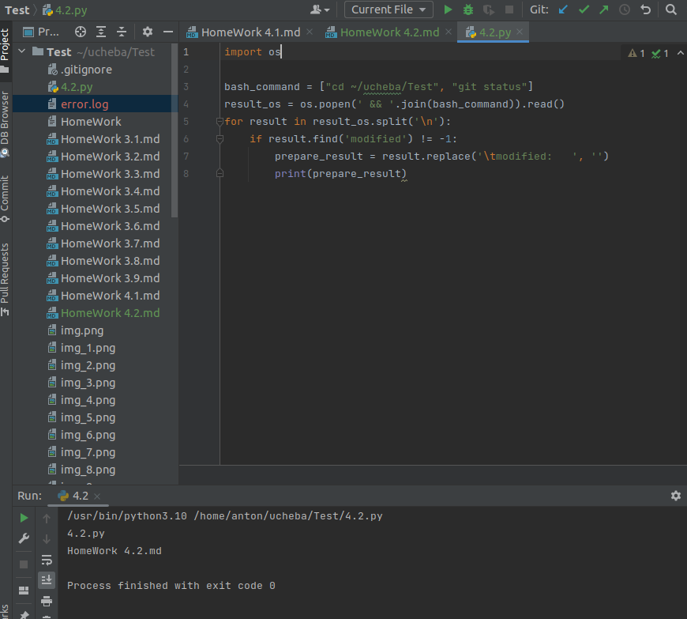
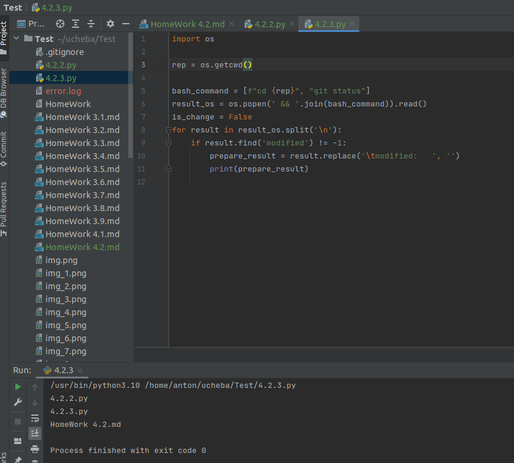
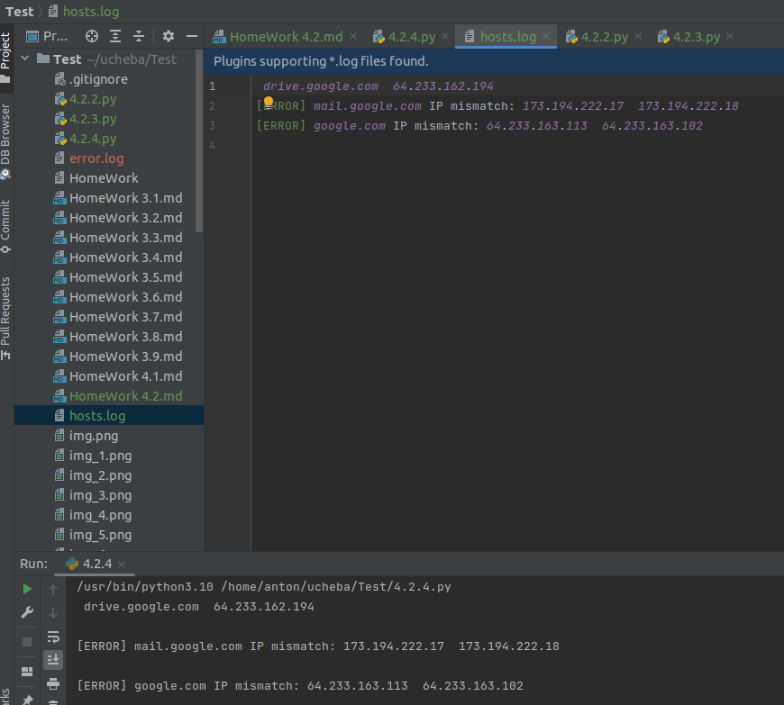

1. Есть скрипт:

#!/usr/bin/env python3
a = 1
b = '2'
c = a + b

    * Решение:
        Какое значение будет присвоено переменной c - ошибк, сложение строковой величины и целочисленной.
        Как получить для переменной c значение 12 - с = str(a) + b
        Как получить для переменной c значение 3? - c = a + int(b)

2. Мы устроились на работу в компанию, где раньше уже был DevOps Engineer. Он написал скрипт, позволяющий узнать, какие файлы модифицированы в репозитории, относительно локальных изменений. Этим скриптом недовольно начальство, потому что в его выводе есть не все изменённые файлы, а также непонятен полный путь к директории, где они находятся.

Как можно доработать скрипт ниже, чтобы он исполнял требования вашего руководителя?

    * Решение:
        #!/usr/bin/env python3
        import os
        
        bash_command = ["cd ~/ucheba/Test", "git status"]
        result_os = os.popen(' && '.join(bash_command)).read()
        for result in result_os.split('\n'):
            if result.find('modified') != -1:
                prepare_result = result.replace('\tmodified:   ', '')
                print(prepare_result)
    

3. Доработать скрипт выше так, чтобы он мог проверять не только локальный репозиторий в текущей директории, а также умел воспринимать путь к репозиторию, который мы передаём как входной параметр. Мы точно знаем, что начальство коварное и будет проверять работу этого скрипта в директориях, которые не являются локальными репозиториями.

    * Решение:
            import os
            
            #!/usr/bin/env python3
            rep = os.getcwd()
            
            bash_command = [f"cd {rep}", "git status"]
            result_os = os.popen(' && '.join(bash_command)).read()
            is_change = False
            for result in result_os.split('\n'):
                if result.find('modified') != -1:
                    prepare_result = result.replace('\tmodified:   ', '')
                    print(prepare_result)

4. Наша команда разрабатывает несколько веб-сервисов, доступных по http. Мы точно знаем, что на их стенде нет никакой балансировки, кластеризации, за DNS прячется конкретный IP сервера, где установлен сервис.

Проблема в том, что отдел, занимающийся нашей инфраструктурой очень часто меняет нам сервера, поэтому IP меняются примерно раз в неделю, при этом сервисы сохраняют за собой DNS имена. Это бы совсем никого не беспокоило, если бы несколько раз сервера не уезжали в такой сегмент сети нашей компании, который недоступен для разработчиков.

Мы хотим написать скрипт, который:

опрашивает веб-сервисы,
получает их IP,
выводит информацию в стандартный вывод в виде: <URL сервиса> - <его IP>.
Также, должна быть реализована возможность проверки текущего IP сервиса c его IP из предыдущей проверки. Если проверка будет провалена - оповестить об этом в стандартный вывод сообщением: [ERROR] <URL сервиса> IP mismatch: <старый IP> <Новый IP>. Будем считать, что наша разработка реализовала сервисы: drive.google.com, mail.google.com, google.com.

   * Решение:

         #!/usr/bin/env python3
         import socket
         from string import whitespace
         
         hosts = ["drive.google.com", "mail.google.com", "google.com"]
         fileList = []
         
         with open('hosts.log') as file:
             for f in file:
                 fileList.append(f)
         
         with open('hosts.log', 'w+') as file:
             for i in hosts:
                 result = socket.gethostbyname(i)
                 added = 0
                 for y in fileList:
                     inList = y.find(" {}".format(i))
                     if (inList != -1):
                         ipstr=y.replace('\n', '').split("  ")[1].translate({None: whitespace})
                         if (ipstr == result):
                             print(" {}  {}\n".format(i, result))
                             file.write(" {}  {}\n".format(i, result))
                             added = 1
                             break
                         else:
                             print("[ERROR] {} IP mismatch: {}  {}\n".format(i, ipstr, result))
                             file.write("[ERROR] {} IP mismatch: {}  {}\n".format(i, ipstr, result))
                             added = 1
                             break
                 if (added == 0):
                     print(" {}  {}\n".format(i, result))
                     file.write(" {}  {}\n".format(i, result))
   * 