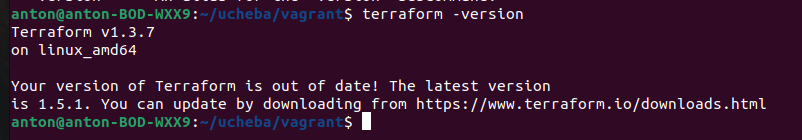
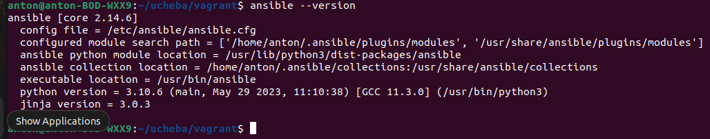
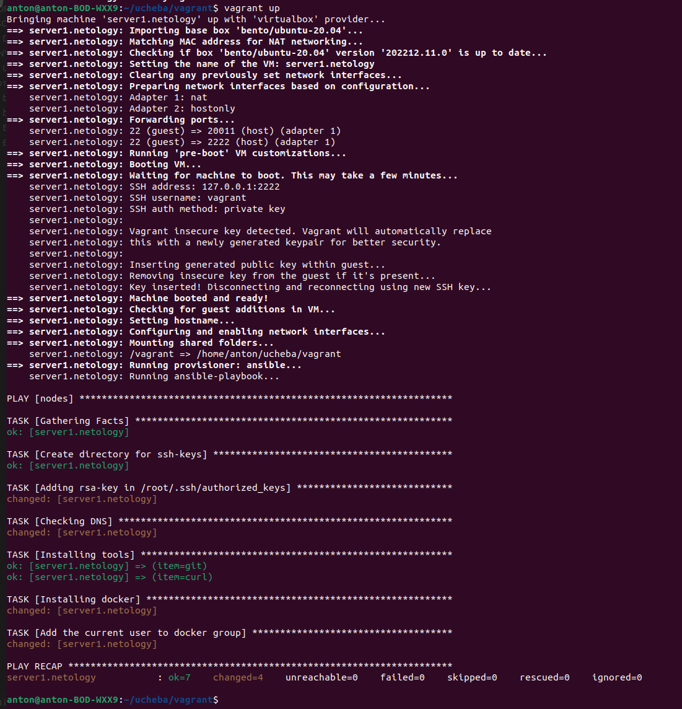

## Задача 1

- Опишите основные преимущества применения на практике IaaC-паттернов.
- Какой из принципов IaaC является основополагающим?

### Решение:

- Оснвные преимущества IaaC состоит в скорости и уменьшение затрат. IaC позволяет быстрее конфигурировать инфраструктуру и направлен на обеспечение прозрачности, чтобы помочь другим командам со всего предприятия работать быстрее и эффективнее.

- Основопологающий принцип iaaC это - инфраструктура это код.

## Задача 2

- Чем Ansible выгодно отличается от других систем управление конфигурациями?
- Какой, на ваш взгляд, метод работы систем конфигурации более надёжный — push или pull?

### Решение:

-  Ansible отличается скоростью, простотой, расширяемостью. 
- Надежнее Push

## Задача 3

Установите на личный компьютер:

- VirtualBox,
- Vagrant,
- Terraform,
- Ansible.

Приложите вывод команд установленных версий каждой из программ, оформленный в Markdown.

### Решение:

- VirtualBox 
- 
- Vagrant 
-  
- Terraform 
- 
- Ansible
- 

## Задача 4

Воспроизведите практическую часть лекции самостоятельно.

### Решение:

- Создайте виртуальную машину.
- 
- Зайдите внутрь ВМ, убедитесь, что Docker установлен с помощью команды
- 
