1. Узнайте о sparse (разряженных) файлах.
	
	* Решение: Цитата: файл, в котором последовательности нулевых байтов заменены на информацию об этих последовательностях (список дыр).
	
2. Могут ли файлы, являющиеся жесткой ссылкой на один объект, иметь разные права доступа и владельца? Почему?
	
	* Решение: Нет. это ссылки на одну и ту же inode.
	
3. Сделайте vagrant destroy на имеющийся инстанс Ubuntu. Замените содержимое Vagrantfile следующим:

	* Решение: 
	*  

4. Используя fdisk, разбейте первый диск на 2 раздела: 2 Гб, оставшееся пространство.

	* Решение: 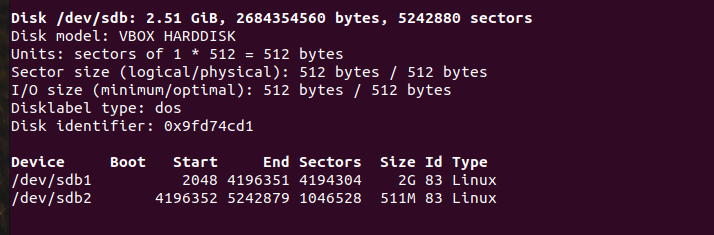
   
5. Используя sfdisk, перенесите данную таблицу разделов на второй диск.
	
	* Решение: 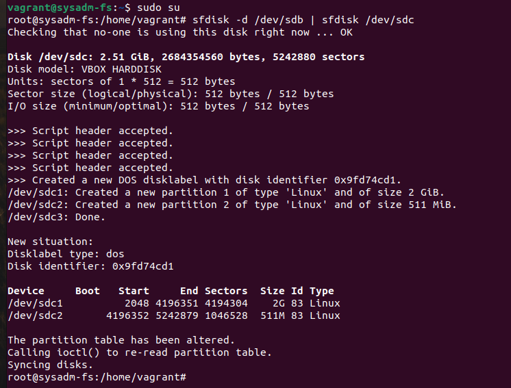
   
6. Соберите mdadm RAID1 на паре разделов 2 Гб.

	* Решение: 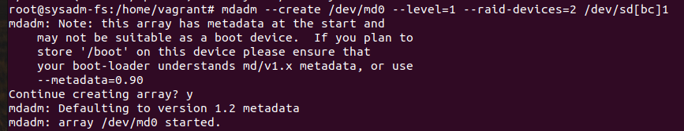

7. Соберите mdadm RAID0 на второй паре маленьких разделов.

	* Решение: 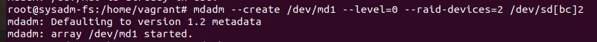

8. Создайте 2 независимых PV на получившихся md-устройствах.

	* Решение:
    * 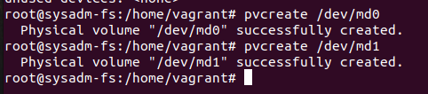
   
9. Создайте общую volume-group на этих двух PV.

	* Решение: 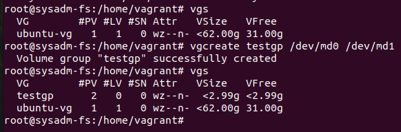

10. Создайте LV размером 100 Мб, указав его расположение на PV с RAID0.

	* Решение: 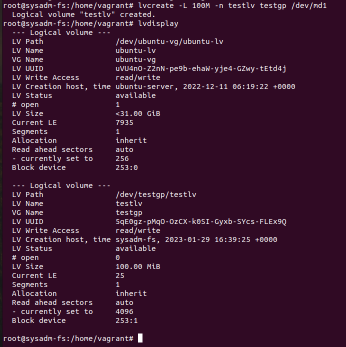

11. Создайте mkfs.ext4 ФС на получившемся LV.

	* Решение: 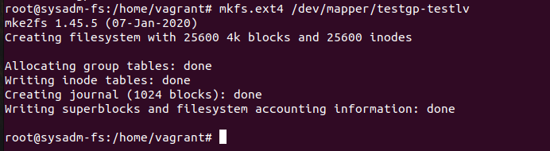

12. Смонтируйте этот раздел в любую директорию, например, /tmp/new.

	* Решение: 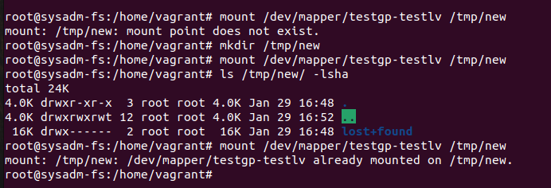

13. Поместите туда тестовый файл, например wget https://mirror.yandex.ru/ubuntu/ls-lR.gz -O /tmp/new/test.gz.

	* Решение: 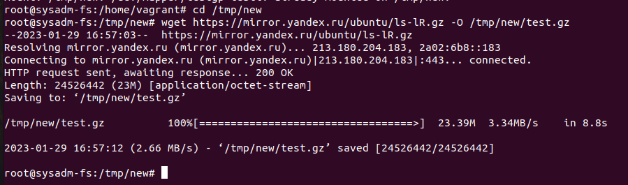

14. Прикрепите вывод lsblk.

	* Решение: 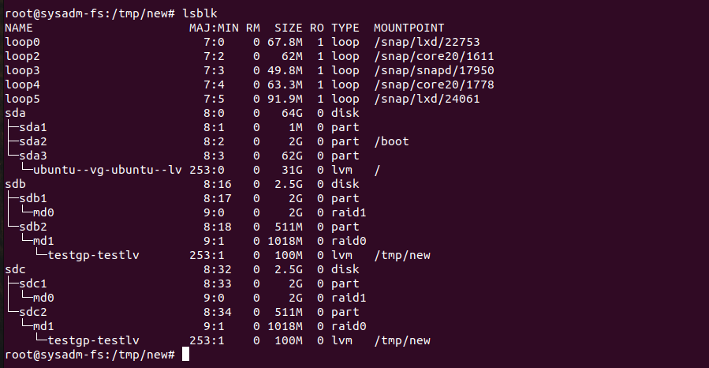

15. Протестируйте целостность файла:

	* Решение: 
    * 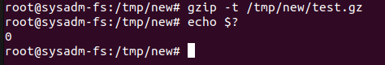

16. Используя pvmove, переместите содержимое PV с RAID0 на RAID1.

	* Решение: 
    * 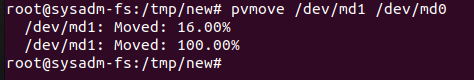

17. Сделайте --fail на устройство в вашем RAID1 md.

	* Решение: 
    * 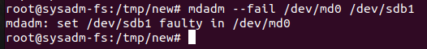

18. Подтвердите выводом dmesg, что RAID1 работает в деградированном состоянии.

	* Решение: 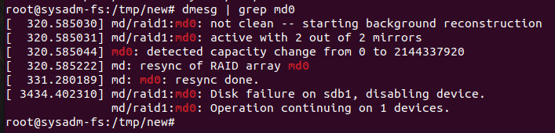

19. Протестируйте целостность файла, несмотря на "сбойный" диск он должен продолжать быть доступен.

	* Решение: 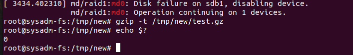

20. Погасите тестовый хост, vagrant destroy

	* Решение: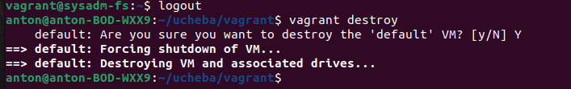