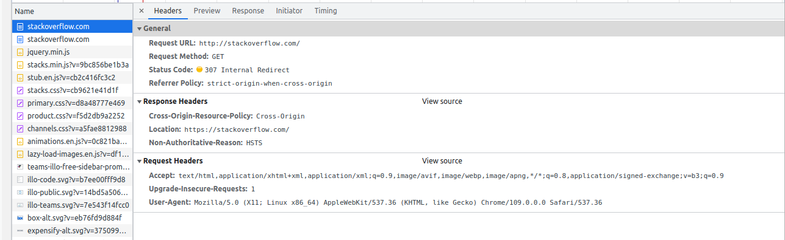
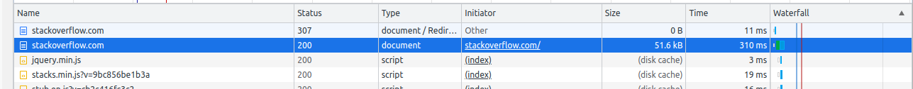
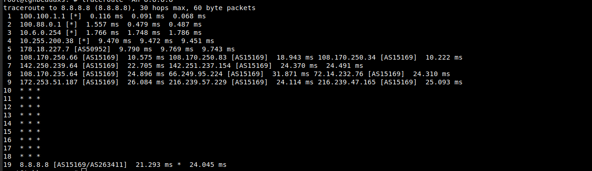
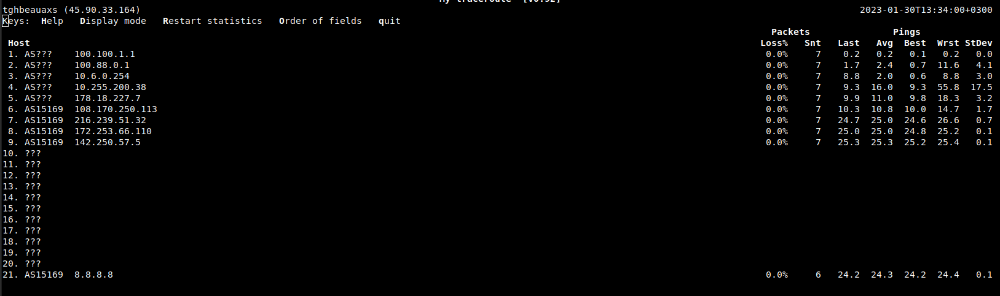
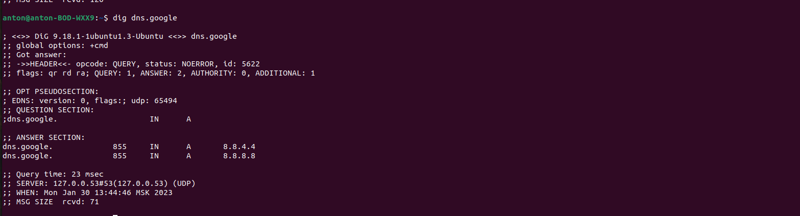
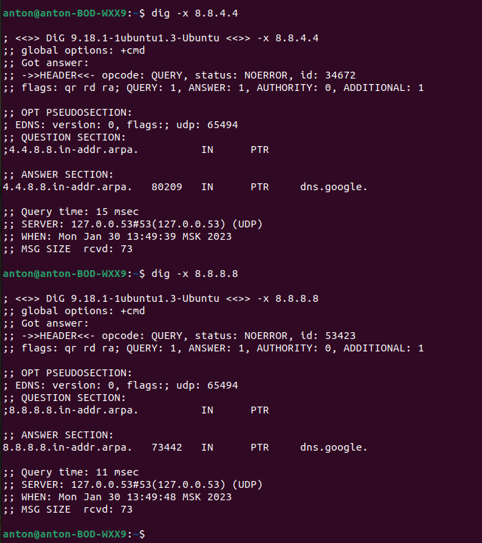

1. Работа c HTTP через телнет.

    * Решение:

            anton@anton-BOD-WXX9:~$ telnet stackoverflow.com 80
                    Trying 151.101.1.69...
                    Connected to stackoverflow.com.
                    Escape character is '^]'.
                    GET /questions HTTP/1.0
                    HOST: stackoverflow.com
                    
                    HTTP/1.1 403 Forbidden
                    Connection: close
                    Content-Length: 1920
                    Server: Varnish
                    Retry-After: 0
                    Content-Type: text/html
                    Accept-Ranges: bytes
                    Date: Mon, 30 Jan 2023 09:20:40 GMT
                    Via: 1.1 varnish
                    X-Served-By: cache-fra-eddf8230085-FRA
                    X-Cache: MISS
                    X-Cache-Hits: 0
                    X-Timer: S1675070441.673440,VS0,VE1
                    X-DNS-Prefetch-Control: off
                    
                    <!DOCTYPE html>
                    <html>
                    <head>
                        <meta http-equiv="Content-Type" content="text/html; charset=UTF-8" />
                        <title>Forbidden - Stack Exchange</title>
                        
                    </head>
                    <body>
                        

                            

                                
                            

                            

                                <h1>Access Denied</h1>
                                            
This IP address (90.154.25.126) has been blocked from access to our services. If you believe this to be in error, please contact us at <a href="mailto:team@stackexchange.com?Subject=Blocked%2090.154.25.126%20(Request%20ID%3A%201881078618-FRA)">team@stackexchange.com</a>.

                                            
When contacting us, please include the following information in the email:

                                            
Method: block

                                            
XID: 1881078618-FRA

                                            
IP: 90.154.25.126

                                            
X-Forwarded-For: 

                                            
User-Agent: 

                                            
                                            
Time: Mon, 30 Jan 2023 09:20:40 GMT

                                            
URL: stackoverflow.com/questions

                                            
Browser Location: (not loaded)

                            

                        

                        
                    </body>
                    </html>Connection closed by foreign host.

Код ответа на статус ошибки "HTTP 403 Forbidden" указывает, что сервер понял запрос, но отказывается его авторизовать.

2. Повторите задание 1 в браузере, используя консоль разработчика F12.

    * Решение: 
      * откройте вкладку Network
      * отправьте запрос http://stackoverflow.com
      * найдите первый ответ HTTP сервера, откройте вкладку Headers
        * 
      * укажите в ответе полученный HTTP код 
        * 307 Internal Redirect
      * проверьте время загрузки страницы, какой запрос обрабатывался дольше всего? 
        * 
        * время полной загрузки 1.26 с

3. Какой IP адрес у вас в интернете?

    * Решение: 90.154.25.126 

4. Какому провайдеру принадлежит ваш IP адрес? Какой автономной системе AS? Воспользуйтесь утилитой whois

    * Решение:
      * origin:AS12389
      * mnt-by:ROSTELECOM-MNT

5. Через какие сети проходит пакет, отправленный с вашего компьютера на адрес 8.8.8.8? Через какие AS? Воспользуйтесь утилитой traceroute

    * Решение: 
    * 

6. Повторите задание 5 в утилите mtr. На каком участке наибольшая задержка - delay?

    * Решение: 
    * 

7. Какие DNS сервера отвечают за доменное имя dns.google? Какие A записи? Воспользуйтесь утилитой dig

    * Решение: 
    * 

8. Проверьте PTR записи для IP адресов из задания 7. Какое доменное имя привязано к IP? Воспользуйтесь утилитой dig

    * Решение: 
    * 