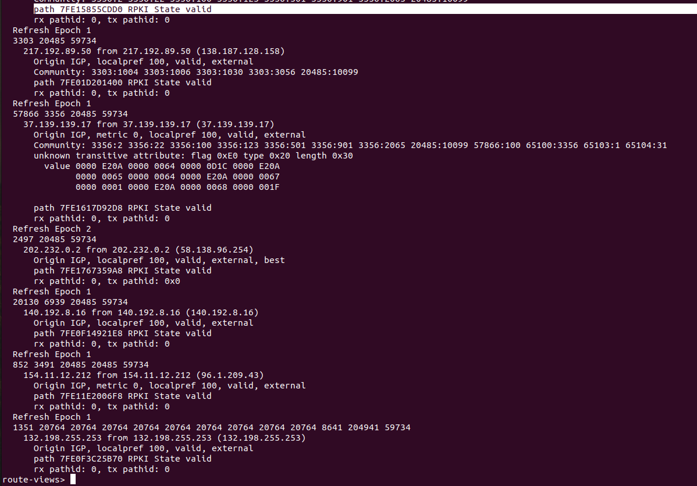

1. Подключитесь к публичному маршрутизатору в интернет. Найдите маршрут к вашему публичному IP

    * Решение: 
    * 
    * 
    * 
    * 

2. Создайте dummy0 интерфейс в Ubuntu. Добавьте несколько статических маршрутов. Проверьте таблицу маршрутизации.

    * Решение: 
    * 

3. Проверьте открытые TCP порты в Ubuntu, какие протоколы и приложения используют эти порты? Приведите несколько примеров.

    * Решение:
    * 
    * 54 - systemd
    * 22 - ssh

4. Проверьте используемые UDP сокеты в Ubuntu, какие протоколы и приложения используют эти порты?

    * Решение:
    * 
    * 53,68

5. Используя diagrams.net, создайте L3 диаграмму вашей домашней сети или любой другой сети, с которой вы работали.

    * Решение: 
    * 